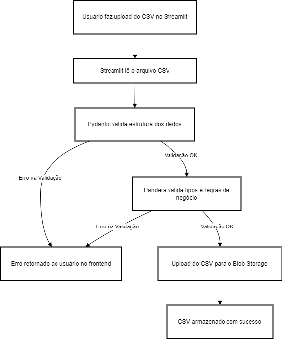

# Validação de CSV no Frontend com Streamlit, Pydantic, Pandera e Blob Storage
Este projeto é um sistema de validação e upload de arquivos CSV através de um frontend simples desenvolvido com Streamlit. 
O fluxo inclui a validação da estrutura e dos dados dos CSVs usando Pydantic e Pandera, e o upload para um Blob Storage em caso de sucesso. Se ocorrerem erros durante as validações, uma mensagem detalhada é retornada ao usuário no frontend.

### 📋 Funcionalidades
- Upload de arquivos CSV através da interface do Streamlit.
- Validação da estrutura e dos tipos de dados dos CSVs usando Pydantic e Pandera.
- Retorno de mensagens de erro detalhadas caso as validações falhem.
- Upload dos arquivos para um Blob Storage em caso de validação bem-sucedida.

### 🛠 Tecnologias Utilizadas
- Streamlit: Framework para construção rápida de aplicativos web interativos em Python.
- Pydantic: Ferramenta para validação de dados e gerenciamento de tipos com Python.
- Pandera: Biblioteca para validação de dados de DataFrames (pandas) e integração com regras de negócios.
- Blob Storage: Solução de armazenamento para armazenar arquivos validados.

### 🧩 Como Funciona


- O usuário faz upload de um arquivo CSV através da interface do Streamlit.
- O Streamlit lê o CSV e o envia para a primeira etapa de validação:
- Pydantic valida a estrutura básica do CSV (ex.: colunas esperadas e tipos).
- Caso a validação falhe, uma mensagem de erro é retornada ao usuário no frontend.
- Se passar na primeira etapa, o CSV é enviado para a segunda etapa de validação:
- Pandera aplica validações mais detalhadas, como regras de negócio específicas e tipos de dados esperados.
S- e houver falha nessa etapa, uma mensagem detalhada é exibida ao usuário.
- Se todas as validações forem bem-sucedidas, o arquivo é enviado ao Blob Storage.
- O usuário é notificado sobre o sucesso do upload.

### 🚀 Como Executar o Projeto
Clone este repositório:
```bash
Copiar código
git clone 
```
Instale as dependências:
```bash
Copiar código
pip install -r requirements.txt
```

Execute a aplicação:
```bash
Copiar código
streamlit run app.py
```